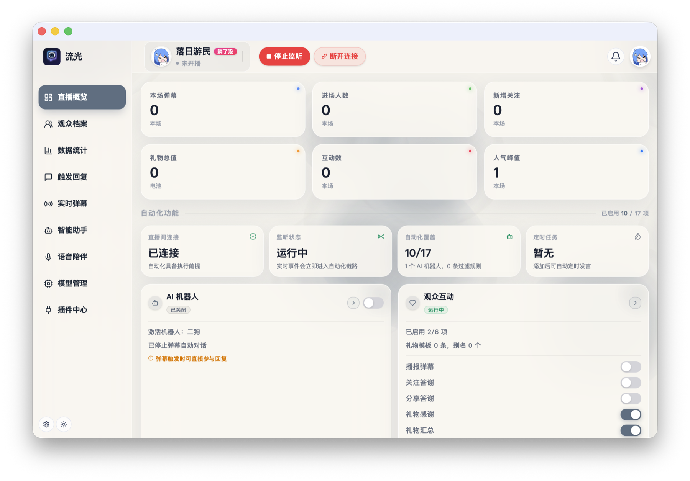
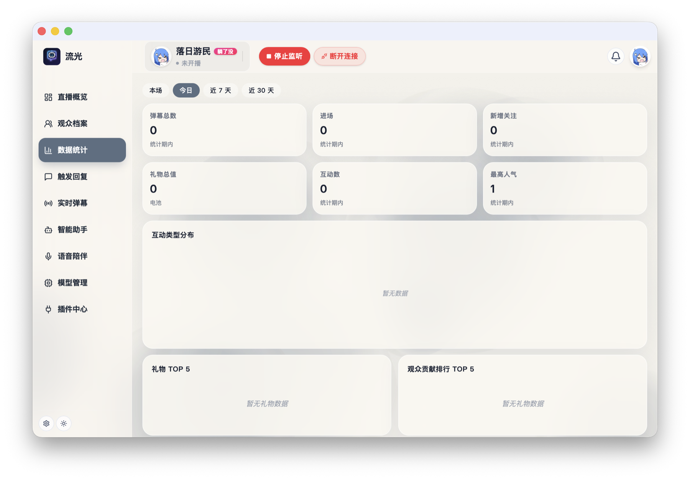
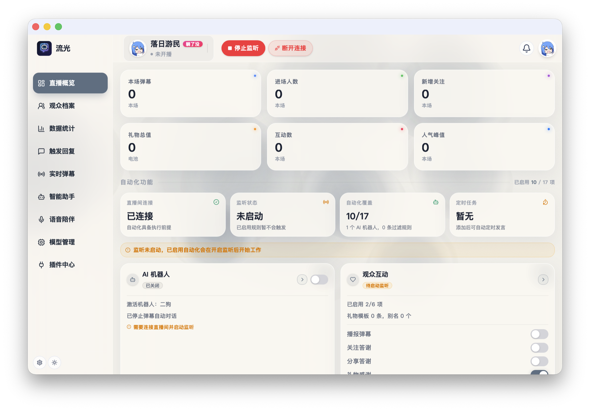
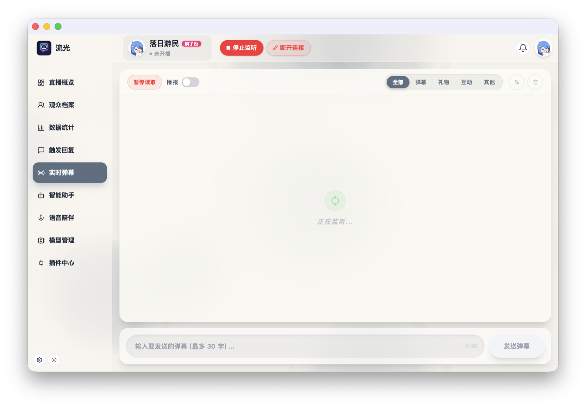
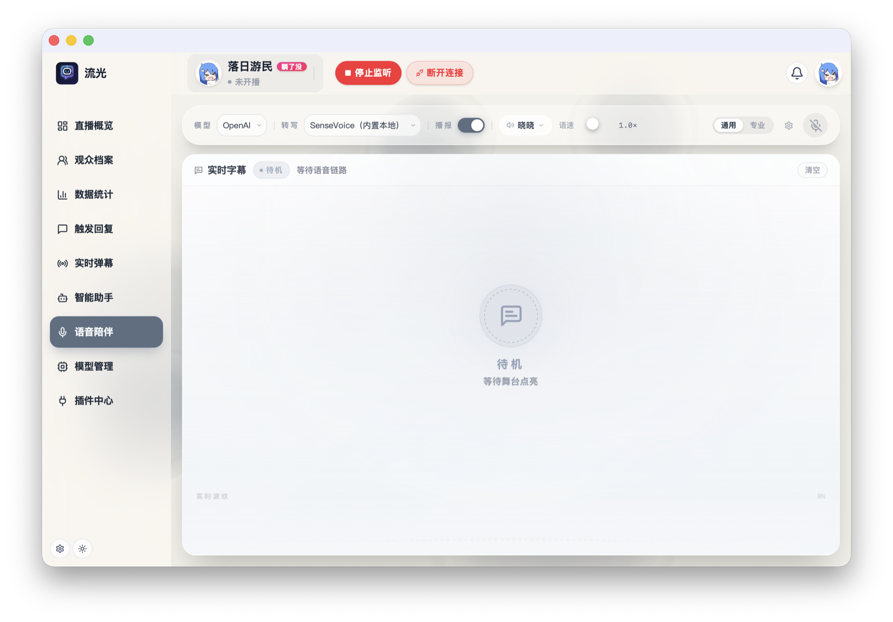
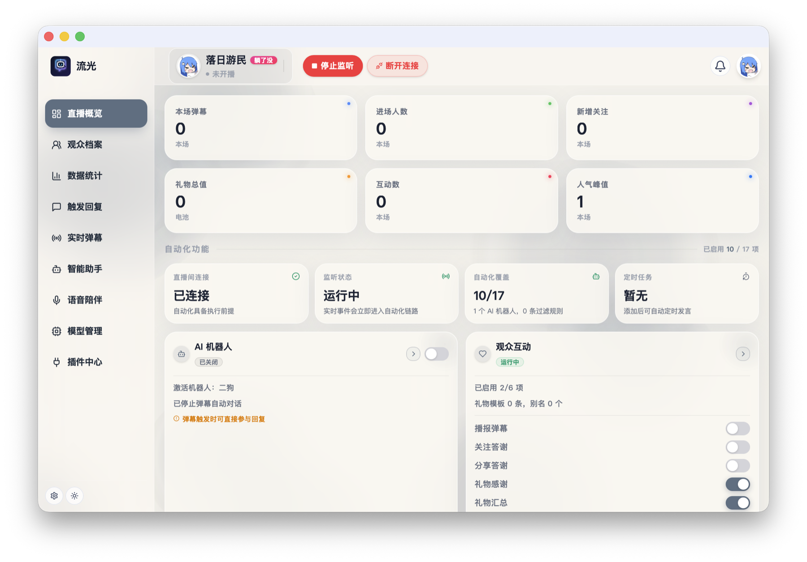

# Streamix

**Streamix** 是一个面向 Bilibili 直播间的桌面场控系统，使用 Rust + Tauri 构建。  
它的目标不是只做“自动回复工具”，而是逐步演进成一个具备实时监听、规则调度、语音交互、模型接入、数据沉淀与更新分发能力的直播智能助手。

当前仓库是 **私有源码仓库**。公开发布产物与自动更新资源位于：

- Releases: [https://github.com/Leejaywell/streamix](https://github.com/Leejaywell/streamix)

## 界面预览

Streamix 把直播监听、自动化规则、AI 回复、语音陪伴和 OBS 插件视图集中在一个桌面控制台里。  
主播可以在开播时快速确认房间状态、互动数据和自动化覆盖情况，也可以按需打开弹幕、欢迎语、语音和插件配置。



### 一屏掌握直播状态

直播概览页把本场弹幕、进场人数、新增关注、礼物总值、互动数和人气峰值集中展示，并在下方汇总自动化功能状态。  
连接、监听、AI 机器人、观众互动、礼物答谢和定时任务都能在同一屏里看到是否可用，适合开播前快速巡检。

### 数据统计与互动沉淀



数据统计页按本场、今日、近 7 天和近 30 天切换，帮助主播观察弹幕、进场、关注、礼物和互动趋势。  
礼物 TOP、观众贡献排行和盲盒盈亏统计可以把直播间互动沉淀成本地数据，方便复盘和优化内容节奏。

### 自动欢迎与触发回复



触发回复页把欢迎语、粉丝互动、礼物感谢、定时任务、过滤防护和系统事件分组管理。  
常用话术支持快速预设，也可以为指定 UID 配置专属欢迎语，让自动化回复更贴近直播间风格。

### 实时弹幕与手动发言



实时弹幕页用于监听直播间事件流，支持按弹幕、礼物、互动和其他事件筛选。  
底部输入框可以直接发送弹幕，适合在自动化运行时保留人工介入能力。

### 语音陪伴与字幕链路



语音陪伴页把 ASR、LLM 和 TTS 串成实时语音链路。  
主播可以选择语音转文字模型、播报声音、语速和通用/专业模式，用 AI 作为直播中的语音搭子或辅助回应。

### 弹幕插件与 OBS 展示



插件中心提供弹幕聊天、音乐互动、心愿目标、抽奖互动、礼物特效、最近礼物和礼物排行等浏览器源。  
弹幕样式控制台支持主题、字号、头像、用户名、礼物事件和高级 CSS 调整，右侧可以实时预览接入 OBS 后的效果。

## 项目定位

Streamix 主要解决几类问题：

- 直播间事件太多，人工盯场成本高
- 自动欢迎、答谢、关键词触发等规则容易变得零散
- AI 回复、TTS 播报、ASR 语音输入需要统一编排
- OBS、浏览器源、弹幕插件、数据统计等能力通常分散在不同工具
- 发布桌面应用、做自动更新、兼顾跨平台比较麻烦

这个项目把这些能力收敛到一个 Rust/Tauri 桌面应用中，核心思路是：

- 用 Rust 处理协议、状态、事件流和本地存储
- 用 Tauri + React 负责桌面 UI
- 用独立 crate 封装直播协议和语音能力
- 用 GitHub Releases 提供公开安装包和更新清单

## 主要能力

### 直播监听与互动

- Bilibili 直播 WebSocket 全事件监听
- 实时展示弹幕、礼物、上舰、红包、天选、PK 等事件
- 发送弹幕与快捷话术
- 登录态持久化与房间状态读取

### 自动化规则

- 关键词触发回复
- 分时段欢迎语
- 礼物答谢与聚合
- 黑名单和规则拦截
- 场控流程调度与事件分发

### AI 与语音

- LLM 接入与回复编排
- TTS 语音播报
- ASR 语音识别
- VAD 语音活动检测
- 本地/云端语音模型管理
- 语音陪伴、语音指令、语音变声相关能力

### 桌面端与插件视图

- Tauri 桌面应用
- React/TypeScript 前端界面
- 多模块页面与配置面板
- 弹幕姬浏览器源 / 插件视图
- 与 OBS 相关的浏览器源和场景配合能力

### 数据与更新

- SQLite 本地数据存储
- 日志、配置、token、本地模型缓存
- GitHub Release 自动发布
- Tauri updater 自动更新

## 技术栈

- 后端/核心：Rust
- 桌面壳：Tauri 2
- 前端：React + TypeScript + Vite
- 本地存储：SQLite
- 网络：reqwest / tokio / tungstenite
- 语音相关：`sherpa-onnx`、`ort`、`cpal` 等

## 仓库结构

### 主要目录

- `src/`
  Rust 主程序逻辑，包含 API、bot、配置、存储、弹幕服务等核心模块。
- `src/main.rs`
  应用入口、Tauri commands 注册、桌面应用生命周期。
- `src/api.rs`
  Bilibili HTTP API 封装，例如登录、房间信息、发送弹幕、开播/下播等。
- `src/bot/`
  场控引擎、监听循环、规则执行、互动逻辑。
- `src/storage/`
  SQLite 存储层与互动记录持久化。
- `src/danmaku_chat_server.rs`
  浏览器源/插件视图相关服务端逻辑。
- `src-tauri/`
  桌面端前端资源、React 页面、Vite 构建产物。
- `crates/bilibili-live-protocol/`
  Bilibili 直播协议解析 crate。
- `crates/voice/`
  ASR / TTS / VAD / 语音会话 / 语音变声相关 crate。
- `capabilities/`
  Tauri capability 配置。
- `etc/`
  本地运行配置目录。
- `db/`
  本地 SQLite 数据库目录。
- `logs/`
  运行日志目录。
- `token/`
  Bilibili 登录凭证与令牌缓存。
- `voices/`
  本地语音相关资源目录。
- `.github/workflows/`
  CI / 发布工作流。

### 文档目录

- `docs/roadmap.md`
  项目路线图。
- `docs/adr/`
  架构决策记录。
- `docs/figma/`
  设计与界面相关资料。
- `docs/superpowers/`
  研发过程文档。

## 开发环境

建议准备：

- Rust stable
- Node.js 20+
- npm
- macOS 或 Windows

如果要构建 Tauri 桌面应用，还需要对应平台的原生构建依赖：

- macOS：Xcode Command Line Tools
- Windows：Visual Studio Build Tools / MSVC

## 本地开发

### 安装前端依赖

```bash
cd src-tauri
npm install
cd ..
```

### 启动桌面开发模式

```bash
cargo run --features tauri
```

### 常用校验

```bash
cargo check -p streamix-voice --features vad,voice-changer,local-tts
cargo check --features tauri
```

### 前端单独构建

```bash
cd src-tauri
npm run build
```

## 首次启动后的本地文件

程序首次运行后，通常会生成或使用以下目录：

- `etc/`
  应用配置文件，例如 Bilibili、AI、TTS、ASR、OBS 等设置。
- `token/`
  Bilibili 登录态缓存。
- `db/`
  SQLite 数据库。
- `logs/`
  运行日志。
- `voices/`
  本地语音资源。

这些目录都属于本地运行态数据，不应直接作为发布资源提交。

## 语音与模型说明

项目里同时存在两类语音依赖：

- `ort`
  主要用于 ONNX Runtime 相关能力
- `sherpa-onnx`
  主要用于本地 ASR / TTS / VAD 相关能力

在本地和 CI 中，这部分构建对平台差异比较敏感，尤其是：

- macOS 与 Windows 的预编译包不同
- Windows 需要注意 `MD/MT` 运行时匹配
- `SHERPA_ONNX_ARCHIVE_DIR` 与 `SHERPA_ONNX_LIB_DIR` 只应该在合适的平台与场景下注入

仓库当前的发布 workflow 已对 macOS / Windows 分别做了处理。

## 构建与发布

### 本地 release 构建

```bash
cargo build --release --features tauri
```

### GitHub 发布结构

当前发布结构已经拆分为两部分：

- 私有源码仓库：`Leejaywell/live-bot`
- 公开发布仓库：`Leejaywell/streamix`

发布流程大致如下：

1. 在源码仓库打 tag
2. GitHub Actions 构建 macOS / Windows 安装包
3. 构建产物发布到公开仓库 `streamix`
4. Tauri updater 从公开仓库读取 `latest.json`

这意味着：

- 源码可以保持私有
- 安装包和自动更新资源仍然公开可访问

## 自动更新

桌面端自动更新依赖 Tauri updater。  
更新清单和安装包来自公开 releases 仓库，而不是当前源码仓库。

如果你调整了发布仓库、tag 策略或签名密钥，需要同步检查：

- `tauri.conf.json` 中的 updater `endpoints`
- GitHub Actions 的发布目标仓库
- `TAURI_SIGNING_PRIVATE_KEY` 与其对应公钥

## 当前状态与规划

项目当前已经具备：

- Tauri 桌面应用壳
- 直播监听与互动基础能力
- 规则化场控框架
- AI / ASR / TTS / VAD 相关模块基础设施
- 公开 release 分发与 updater 结构

后续方向见：

- [docs/roadmap.md](/Users/lee/workspaces/ai/live-bot/docs/roadmap.md)

## 参考与鸣谢

以下项目对本仓库有直接影响或启发：

- [BilibiliDanmuRobot](https://github.com/xbclub/BilibiliDanmuRobot)
- [bilibili_live](https://github.com/k-si/bilibili_live)
- [RealtimeAPI](https://github.com/SquadyAI/RealtimeAPI)
- [BiliBIli-Live-Protocol](https://github.com/Sora-Neko/BiliBIli-Live-Protocol)

## 说明

当前 README 重点描述的是：

- 这个仓库现在承担什么职责
- 代码主要分布在哪些目录
- 本地开发和发布链路怎么跑
- 语音模型与跨平台构建为什么相对复杂

如果后续你希望 README 更偏向“开源项目主页文案”而不是“工程文档”，可以再进一步拆成：

- `README.md`：面向用户/访客
- `docs/development.md`：面向开发者
